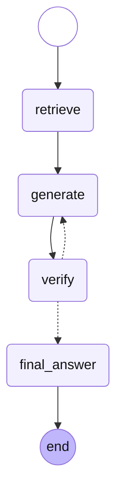

# 8주차 과제 — LangGraph AI Agent

## 회고


7주차 langchain을 LangGraph로 마이그레이션했다. 
langgraph의 노드 안에 langchain에서 쓰던 langchain을 그대로 활용했다.
```
chain = (prompt_template | structured_model)
```
원래 이렇게 하는 건가?

만들다 보니깐 LLM 출력으로 흐름을 조절할 필요성을 느꼈다. 어떻게 구현할까 고민하던 도중, 저번에 배훈 출력 구조화가 생각났다. Pydantic `with_structured_output()`으로 LLM 출력을 구조화했는데, 생각보다 잘 작동했다. 원래 이렇게 쓰는 건가? `answer["field"]`가 아니라 `answer.field`로 접근한다는 것도 배웠다.

 원래는 count 변수를 State에 추가해서, 0회면 그냥 넘어가고 일정 횟수 이상이면 LLM이 "난 모르겠다"고 이실직고하는 방식으로 구현하려 했는데, TypedDict로 State를 정의할 때, 첫 invoke에서 없는 키를 `state["key"]`로 접근하면 KeyError가 나는데.클로드쌤이 `state.get("key", default)`를 추천해줘서 임시방편으로 그렇게 구현했다. 나중에 count 기능 추가할 계획이다.

gemini 2.5 flash를 사용했는데, 나중에 내 언어모델을 만들면 그 둘을 선택해서 할 수 있도록 할 계획이다.
더 좋은 모델을 verify 하는 데에, 또 evaluate.py에 사용하지 못했다는 한계점이 있다.
evaluate.py는 토큰 없어서 실행 안해봤지만 연결 최신화해서 langsmith 인식은 해둬서 tracing은 성공했다.
claude 새 api 키 받은걸로 할 수 있겠지만, 아깝기도 하고 무섭기도 해서.. 그리고 파인만 문서를 다 chromadb로 임포트하겠다는 계획이 있어서 그거에 우선 사용할 예정이다. 리필되는 월말에 한번 해야지.. 언제 리필되더라 확인해봐야겠다.

아 맞다. 문서는 The Feynman Lectures on Physics 텍스트를 가져왔다. 6주차 과제부터 그거 썼었다.
무려 리처드 파인만 교수님이 물리학 강의할 때 쓰시던 노트이다. 물리 교과서가 변하는 일은 자주 없기에, 현재에도 중요한 insight들을 많이 담고 있고, 놀랍도록 친절하다. 칼텍 사이트에 무료로 공개하셨는데, 물리(+영어+수학)를 취미로 공부하고 싶으면 충분히 도움받을 수 있다. 나도 다시 읽어야지..
https://www.feynmanlectures.caltech.edu/
"I learned very early the difference between knowing the name of something and knowing something." 
나는 아주 일찍 무언가의 이름을 아는 것과 그것을 아는 것 사이의 차이를 배웠다.- 리처드 파인만

새벽감성으로...

복잡한 워크플로도 구현 못해봤고, tool들을 만들고 사용해보지 못했다. message 기능도 써보고 싶고. 다만 기초적인 수준의 간단한 루프를 계획하고, 실제 돌아가고 verify 루프가 돌때마다 답변이 개선되는것을 시험적으로 확인해 보았다. 나중에 어떤걸 구현할지 계획해놓은게 있는데, 이제 building block들이 다 모인 느낌이다.

count 기능 추가해서 이제 유저가 설정한 limit=4 넘으면 자동으로 루프 탈출하고 그 사유가 verify 통과가 아닌 limit 이라면, 별도의 프롬프트를 통해 모르겠다고 이실직고한다.
```
(08) jimmywon@jjui-MacBookPro 08 % uv run graph.py

fix_needed=True what_to_fix=["원자핵을 구성하는 입자 중 '중성자'는 전하를 띠지 않는다는 점을 명확히 해야 합니다. 현재 답변은 '양성자'와 '중성자' 모두 양전하를 띤다고 설명하고 있습니다."]

fix_needed=True what_to_fix=["원자핵을 구성하는 입자 중 '중성자'가 전하를 띠지 않는다는 내용은 제공된 문서에서 직접적으로 언급되지 않았습니다."]

fix_needed=False what_to_fix=[]
파인만이 설명한 원자는 다음과 같습니다:
*   **모든 물질의 구성 요소:** 원자는 모든 것을 이루는 작은 입자들입니다.
*   **움직임과 상호작용:** 이 작은 입자들은 영구적인 움직임 속에 있으며, 어느 정도 거리가 있으면 서로 끌어당기지만, 서로 밀착되면 밀어냅니다.
*   **구조:**
    *   원자의 중심에는 양전하를 띠고 매우 무거운 '원자핵'이 있습니다.
    *   원자핵은 매우 가볍고 음전하를 띠는 '전자'들에 둘러싸여 있습니다.
    *   원자핵 자체에는 '양성자'와 '중성자'라는 두 종류의 입자가 있으며, 이들은 거의 같은 무게를 가지며 매우 무겁습니다. 양성자는 전기적으로 전하를 띱니다.
*   **결합 특성:** 원자들은 매우 특별하여 특정 파트너나 특정 방향을 선호하는 등 고유한 특성을 가지고 있으며, 이를 통해 서로 결합하여 분자(예: 두 개의 산소 원자가 결합하여 산소 분자를 형성)를 형성합니다.
```

## 개요

7주차 LangChain RAG를 LangGraph `StateGraph`로 마이그레이션하고, verify 루프를 추가해 AI Agent로 확장. FastAPI로 REST API 래핑.

## 파일 구조

```
08/
├── docs/
│   └── feynman.txt       # 파인만 강의록
├── chroma_db/            # ChromaDB 영구 저장소 (06에서 복사)
├── ingest.py             # 인덱싱: 청킹 → 임베딩 → ChromaDB 저장
├── graph.py              # LangGraph StateGraph: retrieve → generate → verify 루프
├── main.py               # FastAPI 래핑: POST /query
└── .env                  # GOOGLE_API_KEY 등 (git 제외)
```

## 그래프 구조

```
START → retrieve → generate → verify → (fix_needed?) → generate (루프)
                                     ↘ END
```

- **retrieve**: 질문을 벡터 검색해 관련 문서 3개 반환
- **generate**: 문서 + 질문으로 답변 생성. fix 브랜치에서는 틀린 부분도 반영
- **verify**: Pydantic 구조화 출력으로 `fix_needed`, `what_to_fix` 판단
- **route_by_fix**: verify 결과에 따라 generate 재실행 또는 종료

## 07 LCEL vs 08 LangGraph 비교

| 항목 | 07 LCEL | 08 LangGraph |
|---|---|---|
| 구조 | 선형 파이프 (`\|`) | 노드 + 엣지 그래프 |
| 루프 | 불가 (DAG) | 가능 (사이클 허용) |
| 상태 관리 | 없음 | `TypedDict` State |
| 조건 분기 | `RunnableBranch` | `add_conditional_edges` |
| 에이전트 패턴 | 어려움 | 자연스럽게 구현 가능 |

## 실행

```bash
# 서버
uv run fastapi dev main.py

# 단독 실행 (터미널 테스트)
uv run graph.py
```

## API

```
POST /query
{"prompt": "파인만이 설명한 원자가 뭐야?"}

→ {"answer": "..."}
```

## 환경변수 (.env)

```
GOOGLE_API_KEY=...
```

## 사용 라이브러리

- `langgraph` — StateGraph, 노드/엣지, 조건 분기
- `langchain-google-genai` — Gemini 임베딩 + LLM
- `langchain-chroma` — ChromaDB 연동
- `langchain-core` — 프롬프트 템플릿, StrOutputParser
- `pydantic` — 구조화 출력 스키마
- `fastapi` + `uvicorn` — REST API
- `python-dotenv` — API 키 관리
